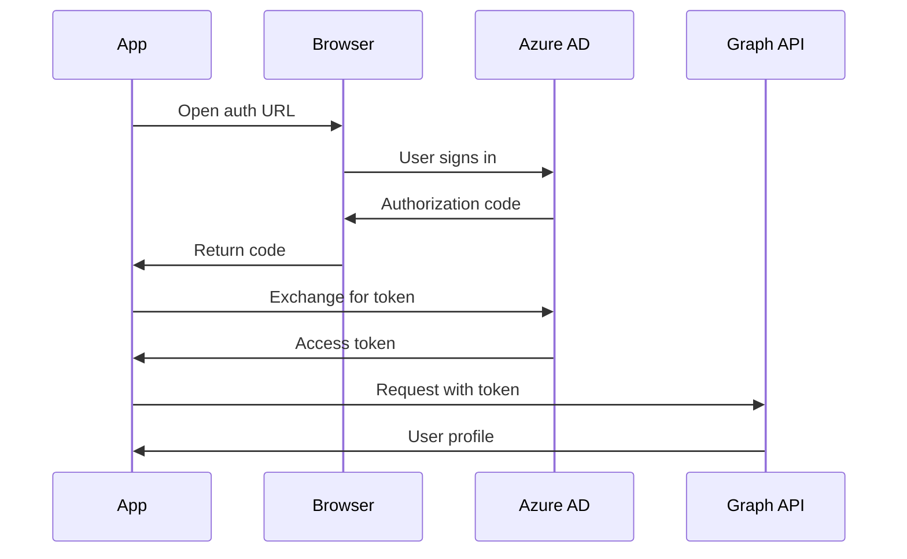

# Exercise: Retrieve User Profile Information using Microsoft Graph

## Overview
Hands-on exercise to create a .NET console application that retrieves user profile information from Microsoft Graph using interactive authentication.

## Prerequisites
- ✅ Azure subscription
- ✅ Visual Studio Code
- ✅ .NET 8.0 SDK or later
- ✅ C# Dev Kit extension for VS Code
- ✅ Azure account with ability to register applications

## Exercise Duration
⏱️ **Approximately 15 minutes**

## Learning Objectives
- Register an application with Microsoft identity platform
- Configure authentication for public client
- Create console application with Microsoft Graph SDK
- Authenticate users interactively
- Retrieve user profile from Microsoft Graph API
- Handle authentication consent flow

## Task 1: Register Application in Azure Portal

### Step 1: Navigate to App Registrations

1. Sign in to [Azure Portal](https://portal.azure.com)
2. Search for **Microsoft Entra ID** (formerly Azure Active Directory)
3. Select **App registrations** from left menu
4. Click **+ New registration**

### Step 2: Configure Application Registration

**Application details**:

| Field | Value |
|-------|-------|
| Name | `myGraphApplication` |
| Supported account types | **Accounts in this organizational directory only (Single tenant)** |
| Redirect URI | Select **Public client/native (mobile & desktop)** |
| Redirect URI value | `http://localhost` |

Click **Register**

### Step 3: Record Application IDs

From the **Overview** page, copy and save:

- **Application (client) ID** - Example: `11111111-1111-1111-1111-111111111111`
- **Directory (tenant) ID** - Example: `22222222-2222-2222-2222-222222222222`

💡 You'll need these values to configure your application.

### Why These Settings?

- **Single tenant**: App only for users in your organization
- **Public client**: No client secret needed (interactive auth)
- **http://localhost**: Redirect for local development

## Task 2: Create Console Application

### Step 1: Create Project Directory

```bash
# Create project folder
mkdir graphapp
cd graphapp

# Create new console application
dotnet new console
```

### Step 2: Install Required NuGet Packages

```bash
# Azure Identity - For authentication
dotnet add package Azure.Identity

# Microsoft Graph SDK - For Graph API calls
dotnet add package Microsoft.Graph

# DotEnv - For environment variables (optional but recommended)
dotnet add package dotenv.net
```

**Package versions** (latest stable):
- `Azure.Identity` - 1.10.0 or later
- `Microsoft.Graph` - 5.0.0 or later
- `dotenv.net` - 3.1.2 or later

### Step 3: Create Environment Configuration

Create `.env` file in project root:

```bash
# .env
CLIENT_ID=11111111-1111-1111-1111-111111111111
TENANT_ID=22222222-2222-2222-2222-222222222222
```

⚠️ **Security**: Add `.env` to `.gitignore` to avoid committing secrets

```bash
# .gitignore
.env
bin/
obj/
```

## Task 3: Write Application Code

### Complete Program.cs

Replace contents of `Program.cs`:

```csharp
using Azure.Identity;
using Microsoft.Graph;
using Microsoft.Graph.Models;

// Load environment variables from .env file
DotEnv.Load();

// Get configuration from environment variables
var clientId = Environment.GetEnvironmentVariable("CLIENT_ID") 
    ?? throw new ArgumentNullException("CLIENT_ID is not set");
var tenantId = Environment.GetEnvironmentVariable("TENANT_ID") 
    ?? throw new ArgumentNullException("TENANT_ID is not set");

// Define required scopes
var scopes = new[] { "User.Read" };

// Configure interactive browser authentication
var options = new InteractiveBrowserCredentialOptions
{
    ClientId = clientId,
    TenantId = tenantId,
    AuthorityHost = AzureAuthorityHosts.AzurePublicCloud,
    RedirectUri = new Uri("http://localhost")
};

// Create credential
var credential = new InteractiveBrowserCredential(options);

// Create Microsoft Graph client
var graphClient = new GraphServiceClient(credential, scopes);

// Retrieve user profile
Console.WriteLine("Retrieving user profile...\n");

try
{
    // Call Microsoft Graph /me endpoint
    var user = await graphClient.Me.GetAsync();

    // Display user information
    Console.WriteLine("User Profile Information:");
    Console.WriteLine("=========================");
    Console.WriteLine($"Display Name: {user?.DisplayName}");
    Console.WriteLine($"User Principal Name: {user?.UserPrincipalName}");
    Console.WriteLine($"User ID: {user?.Id}");
    Console.WriteLine($"Job Title: {user?.JobTitle ?? "Not specified"}");
    Console.WriteLine($"Office Location: {user?.OfficeLocation ?? "Not specified"}");
    Console.WriteLine($"Mobile Phone: {user?.MobilePhone ?? "Not specified"}");
    Console.WriteLine($"Mail: {user?.Mail ?? "Not specified"}");
}
catch (Exception ex)
{
    Console.WriteLine($"Error: {ex.Message}");
}
```

### Code Breakdown

**1. Load environment variables**:
```csharp
DotEnv.Load();
var clientId = Environment.GetEnvironmentVariable("CLIENT_ID");
var tenantId = Environment.GetEnvironmentVariable("TENANT_ID");
```

**2. Define scopes**:
```csharp
var scopes = new[] { "User.Read" };  // Minimum permission for profile
```

**3. Configure authentication**:
```csharp
var options = new InteractiveBrowserCredentialOptions
{
    ClientId = clientId,          // Your app ID
    TenantId = tenantId,          // Your directory ID
    AuthorityHost = AzureAuthorityHosts.AzurePublicCloud,  // Azure cloud
    RedirectUri = new Uri("http://localhost")  // Must match registration
};
```

**4. Create credential**:
```csharp
var credential = new InteractiveBrowserCredential(options);
```

**5. Create Graph client**:
```csharp
var graphClient = new GraphServiceClient(credential, scopes);
```

**6. Call Graph API**:
```csharp
var user = await graphClient.Me.GetAsync();  // GET /me
```

## Task 4: Run the Application

### Step 1: Build and Run

```bash
dotnet run
```

### Step 2: Authentication Flow

**First run**:

1. **Console output**:
   ```
   Retrieving user profile...
   ```

2. **Browser opens automatically** with authentication prompt

3. **Sign in** with your Azure account

4. **Consent screen** appears:
   ```
   myGraphApplication wants to:
   - View your basic profile
   - Maintain access to data you have given it access to
   
   [Accept] [Cancel]
   ```

5. **Click Accept**

6. **Browser shows success**:
   ```
   Authentication complete. You can close this window.
   ```

7. **Console displays profile**:
   ```
   User Profile Information:
   =========================
   Display Name: John Doe
   User Principal Name: john.doe@contoso.com
   User ID: 87d349ed-44d7-43e1-9a83-5f2406dee5bd
   Job Title: Software Engineer
   Office Location: Building 4
   Mobile Phone: +1 555 0102
   Mail: john.doe@contoso.com
   ```

**Subsequent runs**:
- No browser prompt (uses cached token)
- Direct output of profile information
- Token cached in user profile directory

### Token Cache Location

```
Windows: C:\Users\{username}\.IdentityService\msal.cache
Linux: /home/{username}/.IdentityService/msal.cache
macOS: /Users/{username}/.IdentityService/msal.cache
```

## Task 5: Extend the Application

### Add More User Properties

```csharp
// Retrieve specific properties
var user = await graphClient.Me.GetAsync(config =>
{
    config.QueryParameters.Select = new[] 
    { 
        "id", 
        "displayName", 
        "mail", 
        "jobTitle",
        "officeLocation",
        "mobilePhone",
        "department",
        "companyName"
    };
});

Console.WriteLine($"Department: {user?.Department ?? "Not specified"}");
Console.WriteLine($"Company: {user?.CompanyName ?? "Not specified"}");
```

### Retrieve User's Manager

```csharp
// Get user with expanded manager
var user = await graphClient.Me.GetAsync(config =>
{
    config.QueryParameters.Expand = new[] { "manager" };
});

if (user?.Manager is Microsoft.Graph.Models.User manager)
{
    Console.WriteLine($"\nManager: {manager.DisplayName}");
    Console.WriteLine($"Manager Email: {manager.Mail}");
}
```

### Retrieve User's Photo

```csharp
try
{
    // Get user photo
    var photoStream = await graphClient.Me.Photo.Content.GetAsync();
    
    if (photoStream != null)
    {
        // Save to file
        using var fileStream = File.Create("profile-photo.jpg");
        await photoStream.CopyToAsync(fileStream);
        Console.WriteLine("Profile photo saved to profile-photo.jpg");
    }
}
catch (Exception ex)
{
    Console.WriteLine($"No profile photo available: {ex.Message}");
}
```

### Retrieve Recent Emails

**Update scopes** to include mail:

```csharp
var scopes = new[] { "User.Read", "Mail.Read" };
```

**Retrieve messages**:

```csharp
// Get last 10 messages
var messages = await graphClient.Me.Messages.GetAsync(config =>
{
    config.QueryParameters.Top = 10;
    config.QueryParameters.Select = new[] { "subject", "from", "receivedDateTime" };
    config.QueryParameters.Orderby = new[] { "receivedDateTime desc" };
});

Console.WriteLine("\nRecent Emails:");
Console.WriteLine("==============");

foreach (var message in messages?.Value ?? Enumerable.Empty<Message>())
{
    Console.WriteLine($"Subject: {message.Subject}");
    Console.WriteLine($"From: {message.From?.EmailAddress?.Address}");
    Console.WriteLine($"Received: {message.ReceivedDateTime}");
    Console.WriteLine();
}
```

## Task 6: Clean Up Resources

### Delete App Registration

1. Go to [Azure Portal](https://portal.azure.com)
2. Navigate to **Microsoft Entra ID** > **App registrations**
3. Find **myGraphApplication**
4. Click application name
5. Click **Delete** at top
6. Confirm deletion

### Delete Local Token Cache

```bash
# Windows
del %USERPROFILE%\.IdentityService\msal.cache

# Linux/macOS
rm ~/.IdentityService/msal.cache
```

### Delete Project Files

```bash
# From project parent directory
rm -rf graphapp
```

## Troubleshooting

### Error: "AADSTS700016: Application not found"

**Cause**: CLIENT_ID is incorrect

**Solution**: Verify Application (client) ID from Azure Portal

### Error: "AADSTS50011: Redirect URI mismatch"

**Cause**: Redirect URI doesn't match registration

**Solution**: Ensure `http://localhost` is configured in app registration

### Error: "Insufficient privileges to complete the operation"

**Cause**: User.Read permission not granted

**Solution**: 
1. Go to app registration > API permissions
2. Add **Microsoft Graph** > **Delegated permissions** > **User.Read**
3. Click **Grant admin consent** (if required)

### Browser doesn't open

**Cause**: No default browser or firewall blocking

**Solution**: 
1. Check firewall settings
2. Manually copy URL from console
3. Open in browser

### Token expired

**Cause**: Cached token is stale

**Solution**: Delete token cache file (see Clean Up section)

## Key Takeaways

### Authentication Flow



### Scopes vs Permissions

| In App Registration | In Code | Purpose |
|---------------------|---------|---------|
| API Permissions | Scopes array | What app can access |
| User.Read | "User.Read" | Basic profile |
| Mail.Read | "Mail.Read" | Read email |
| Calendars.Read | "Calendars.Read" | Read calendar |

### Authentication Types

| Type | Use Case | User Interaction |
|------|----------|------------------|
| InteractiveBrowserCredential | Desktop apps | Yes - Browser |
| DeviceCodeCredential | Headless/CLI | Yes - Code entry |
| ClientSecretCredential | Daemon/Service | No |
| ManagedIdentityCredential | Azure resources | No |

## Critical Notes
- 💡 **Single tenant** - App registered for one organization
- 🔒 **Public client** - Interactive auth, no secrets
- ✅ **User.Read** - Minimum scope for profile access
- 🎯 **InteractiveBrowserCredential** - Opens browser automatically
- ⚠️ **First run** - Requires user consent
- 🔄 **Token caching** - Subsequent runs use cached token
- 📊 **/.me endpoint** - Returns current authenticated user
- 💡 **$select** - Request specific properties only
- ✅ **$expand** - Include related entities (manager)
- ⚠️ **Redirect URI** - Must match registration exactly

## Exam Tips
- App registration: Record Application (client) ID and Directory (tenant) ID
- Supported account types: Single tenant (one org), Multi-tenant (any org), Personal accounts
- Redirect URI: Public client for desktop/mobile, Web for web apps
- Required packages: Azure.Identity (auth), Microsoft.Graph (SDK)
- InteractiveBrowserCredential: Opens browser for authentication
- Credential options: ClientId, TenantId, AuthorityHost, RedirectUri
- Scopes: Array of permissions like ["User.Read", "Mail.Read"]
- GraphServiceClient: new GraphServiceClient(credential, scopes)
- Get current user: await graphClient.Me.GetAsync()
- First-run consent: User must accept permissions in browser
- Token caching: Subsequent runs use cached token from .IdentityService/msal.cache
- Query parameters: Select (properties), Expand (related entities), Filter, Top, Orderby
- Error handling: Catch exceptions for auth failures, permission issues
- Clean up: Delete app registration, remove token cache, delete project
- Troubleshooting: Verify CLIENT_ID, check redirect URI, ensure API permissions granted

[Learn More](https://learn.microsoft.com/en-us/training/modules/microsoft-graph/5a-exercise-microsoft-graph-user-profile)
